# Automated Analysis Results

## Dataset Overview
Columns: book_id, goodreads_book_id, best_book_id, work_id, books_count, isbn, isbn13, authors, original_publication_year, original_title, title, language_code, average_rating, ratings_count, work_ratings_count, work_text_reviews_count, ratings_1, ratings_2, ratings_3, ratings_4, ratings_5, image_url, small_image_url

## Data Types

Column | Data Type
|---|---|
book_id | int64
goodreads_book_id | int64
best_book_id | int64
work_id | int64
books_count | int64
isbn | object
isbn13 | float64
authors | object
original_publication_year | float64
original_title | object
title | object
language_code | object
average_rating | float64
ratings_count | int64
work_ratings_count | int64
work_text_reviews_count | int64
ratings_1 | int64
ratings_2 | int64
ratings_3 | int64
ratings_4 | int64
ratings_5 | int64
image_url | object
small_image_url | object

## Summary Statistics

Column | Summary
|---|---|
book_id | {'count': 10000.0, 'unique': nan, 'top': nan, 'freq': nan, 'mean': 5000.5, 'std': 2886.8956799071675, 'min': 1.0, '25%': 2500.75, '50%': 5000.5, '75%': 7500.25, 'max': 10000.0}
goodreads_book_id | {'count': 10000.0, 'unique': nan, 'top': nan, 'freq': nan, 'mean': 5264696.5132, 'std': 7575461.863589611, 'min': 1.0, '25%': 46275.75, '50%': 394965.5, '75%': 9382225.25, 'max': 33288638.0}
best_book_id | {'count': 10000.0, 'unique': nan, 'top': nan, 'freq': nan, 'mean': 5471213.5801, 'std': 7827329.890719961, 'min': 1.0, '25%': 47911.75, '50%': 425123.5, '75%': 9636112.5, 'max': 35534230.0}
work_id | {'count': 10000.0, 'unique': nan, 'top': nan, 'freq': nan, 'mean': 8646183.4246, 'std': 11751060.824080039, 'min': 87.0, '25%': 1008841.0, '50%': 2719524.5, '75%': 14517748.25, 'max': 56399597.0}
books_count | {'count': 10000.0, 'unique': nan, 'top': nan, 'freq': nan, 'mean': 75.7127, 'std': 170.47072765025834, 'min': 1.0, '25%': 23.0, '50%': 40.0, '75%': 67.0, 'max': 3455.0}
isbn | {'count': 9300, 'unique': 9300, 'top': '375700455', 'freq': 1, 'mean': nan, 'std': nan, 'min': nan, '25%': nan, '50%': nan, '75%': nan, 'max': nan}
isbn13 | {'count': 9415.0, 'unique': nan, 'top': nan, 'freq': nan, 'mean': 9755044298883.463, 'std': 442861920665.57336, 'min': 195170342.0, '25%': 9780316192995.0, '50%': 9780451528640.0, '75%': 9780830777175.0, 'max': 9790007672390.0}
authors | {'count': 10000, 'unique': 4664, 'top': 'Stephen King', 'freq': 60, 'mean': nan, 'std': nan, 'min': nan, '25%': nan, '50%': nan, '75%': nan, 'max': nan}
original_publication_year | {'count': 9979.0, 'unique': nan, 'top': nan, 'freq': nan, 'mean': 1981.987674115643, 'std': 152.57666516754668, 'min': -1750.0, '25%': 1990.0, '50%': 2004.0, '75%': 2011.0, 'max': 2017.0}
original_title | {'count': 9415, 'unique': 9274, 'top': ' ', 'freq': 5, 'mean': nan, 'std': nan, 'min': nan, '25%': nan, '50%': nan, '75%': nan, 'max': nan}
title | {'count': 10000, 'unique': 9964, 'top': 'Selected Poems', 'freq': 4, 'mean': nan, 'std': nan, 'min': nan, '25%': nan, '50%': nan, '75%': nan, 'max': nan}
language_code | {'count': 8916, 'unique': 25, 'top': 'eng', 'freq': 6341, 'mean': nan, 'std': nan, 'min': nan, '25%': nan, '50%': nan, '75%': nan, 'max': nan}
average_rating | {'count': 10000.0, 'unique': nan, 'top': nan, 'freq': nan, 'mean': 4.002191000000001, 'std': 0.25442748053872905, 'min': 2.47, '25%': 3.85, '50%': 4.02, '75%': 4.18, 'max': 4.82}
ratings_count | {'count': 10000.0, 'unique': nan, 'top': nan, 'freq': nan, 'mean': 54001.2351, 'std': 157369.95643554674, 'min': 2716.0, '25%': 13568.75, '50%': 21155.5, '75%': 41053.5, 'max': 4780653.0}
work_ratings_count | {'count': 10000.0, 'unique': nan, 'top': nan, 'freq': nan, 'mean': 59687.3216, 'std': 167803.7852374182, 'min': 5510.0, '25%': 15438.75, '50%': 23832.5, '75%': 45915.0, 'max': 4942365.0}
work_text_reviews_count | {'count': 10000.0, 'unique': nan, 'top': nan, 'freq': nan, 'mean': 2919.9553, 'std': 6124.378131569911, 'min': 3.0, '25%': 694.0, '50%': 1402.0, '75%': 2744.25, 'max': 155254.0}
ratings_1 | {'count': 10000.0, 'unique': nan, 'top': nan, 'freq': nan, 'mean': 1345.0406, 'std': 6635.626262783459, 'min': 11.0, '25%': 196.0, '50%': 391.0, '75%': 885.0, 'max': 456191.0}
ratings_2 | {'count': 10000.0, 'unique': nan, 'top': nan, 'freq': nan, 'mean': 3110.885, 'std': 9717.123578396993, 'min': 30.0, '25%': 656.0, '50%': 1163.0, '75%': 2353.25, 'max': 436802.0}
ratings_3 | {'count': 10000.0, 'unique': nan, 'top': nan, 'freq': nan, 'mean': 11475.8938, 'std': 28546.449183182456, 'min': 323.0, '25%': 3112.0, '50%': 4894.0, '75%': 9287.0, 'max': 793319.0}
ratings_4 | {'count': 10000.0, 'unique': nan, 'top': nan, 'freq': nan, 'mean': 19965.6966, 'std': 51447.35838380058, 'min': 750.0, '25%': 5405.75, '50%': 8269.5, '75%': 16023.5, 'max': 1481305.0}
ratings_5 | {'count': 10000.0, 'unique': nan, 'top': nan, 'freq': nan, 'mean': 23789.8056, 'std': 79768.88561077163, 'min': 754.0, '25%': 5334.0, '50%': 8836.0, '75%': 17304.5, 'max': 3011543.0}
image_url | {'count': 10000, 'unique': 6669, 'top': 'https://s.gr-assets.com/assets/nophoto/book/111x148-bcc042a9c91a29c1d680899eff700a03.png', 'freq': 3332, 'mean': nan, 'std': nan, 'min': nan, '25%': nan, '50%': nan, '75%': nan, 'max': nan}
small_image_url | {'count': 10000, 'unique': 6669, 'top': 'https://s.gr-assets.com/assets/nophoto/book/50x75-a91bf249278a81aabab721ef782c4a74.png', 'freq': 3332, 'mean': nan, 'std': nan, 'min': nan, '25%': nan, '50%': nan, '75%': nan, 'max': nan}

## Missing Values

Column | Missing Count
|---|---|
book_id | 0
goodreads_book_id | 0
best_book_id | 0
work_id | 0
books_count | 0
isbn | 700
isbn13 | 585
authors | 0
original_publication_year | 21
original_title | 585
title | 0
language_code | 1084
average_rating | 0
ratings_count | 0
work_ratings_count | 0
work_text_reviews_count | 0
ratings_1 | 0
ratings_2 | 0
ratings_3 | 0
ratings_4 | 0
ratings_5 | 0
image_url | 0
small_image_url | 0

## Insights
Based on the provided dataset summary, there are several key insights and visualization suggestions to help better understand the data. Here’s a thorough analysis:

### Key Insights

1. **Authors**:
   - There are a total of **4,664 unique authors** in the dataset, with **Stephen King** appearing most frequently (60 times). This suggests that a few authors have a substantial presence in the dataset.

2. **Rating Distribution**:
   - The **average rating** across all books is approximately **4.00**, which indicates generally favorable reviews.
   - The ratings are divided into five categories (1 to 5 stars), with the highest rated being an average of around **23,790.81 for ratings of 5** and **1,345.04 for ratings of 1**. This suggests a significant skew towards positive ratings.
   
3. **Publication Years**:
   - The **original publication years** range widely from **-1750** to **2017**, with a mean year of about **1981**. This might imply that while many classics are included, there's also a current mix of more recent titles.

4. **Languages**:
   - The dataset shows a diversity of **25 different language codes**, with **English ('eng')** being the most prevalent tallying **6,341 instances**.

5. **Ratings Count**:
   - The average number of **ratings per book** is approximately **54,001**. However, there is a significant variance (indicated by the high standard deviation of **157,369.96**), suggesting a few bestsellers drive higher counts, while many books have fewer ratings.

6. **Text Reviews**:
   - The average number of **text reviews** per book is around **2,919.96**, again with considerable variance which hints at a strong engagement with certain titles.

7. **Missing Values**:
   - Several fields have missing values, especially in the fields related to the **ISBNs** and **original titles**.

### Suggested Visualizations

1. **Bar Chart of the Most Frequent Authors**:
   - Display the top 10 or 20 authors by the number of books they’ve authored. This can help visualize the concentration of content around certain authors.

2. **Histogram of Average Ratings**:
   - A histogram can show the distribution of average ratings, giving insights into how concentrated ratings are around certain scores.

3. **Box Plot of Ratings Count**:
   - A box plot can illustrate the variation in ratings count across different books, highlighting outliers that have significantly more ratings.

4. **Line Plot of Original Publication Year**:
   - A line plot might show the number of publications per year (or decade), revealing trends in book publishing over time.

5. **Pie Chart of Language Distribution**:
   - A pie chart or a bar chart delineating the proportion of books by language. This will highlight the diversity of languages represented in the book corpus.

6. **Heatmap of Ratings by Star Levels**:
   - A heatmap showing the distribution of ratings across all star levels could effectively summarize how many ratings each star level receives.

7. **Scatter Plot of Ratings Count vs. Average Rating**:
   - This scatter plot can reveal any correlation between the number of ratings received and the average rating, showing if highly-rated books tend to attract more reviews.

8. **Missing Values Heatmap**:
   - A heatmap to visualize patterns of missing data across different fields, which could highlight potential data collection issues.

### Conclusion

The provided dataset offers rich insights into book publications, author prevalence, rating behavior, and publication trends. Utilizing the suggested visualizations can help in drawing more profound conclusions and crafting a compelling narrative around this book dataset. This would be extremely valuable for tasks like marketing, recommendations, or even academic research on trends in literature over time.

## Visualizations

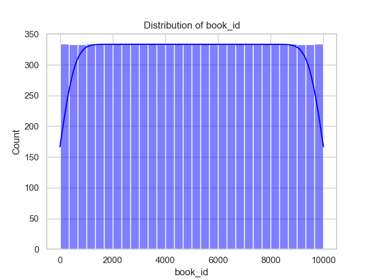

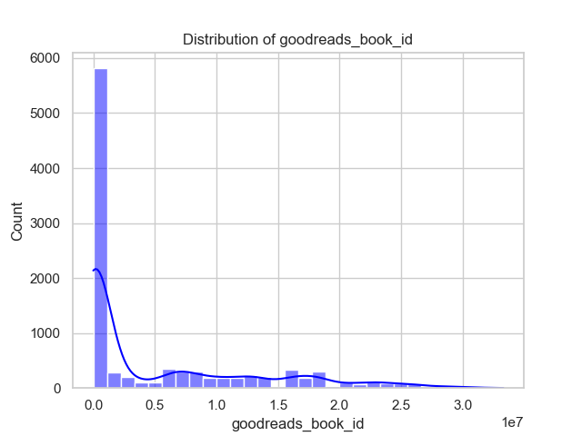

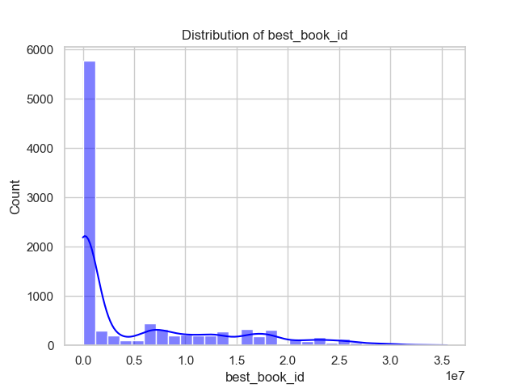

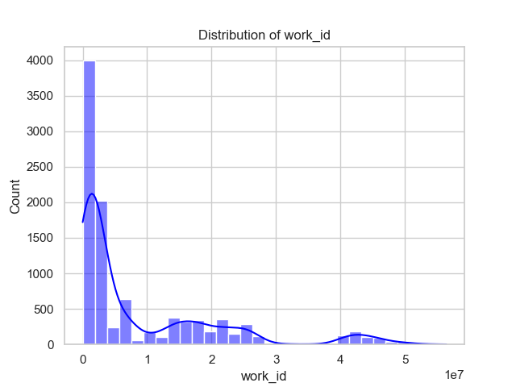

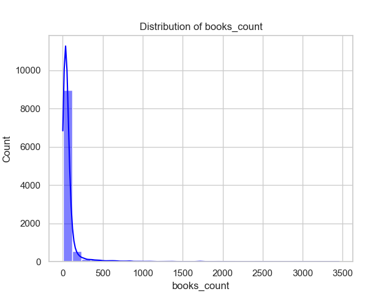

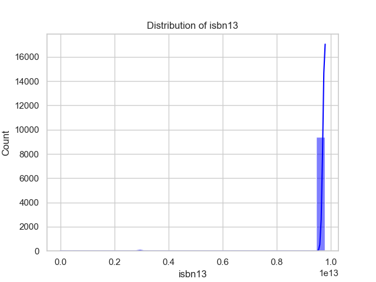

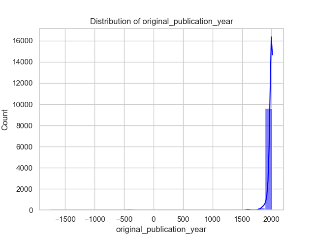

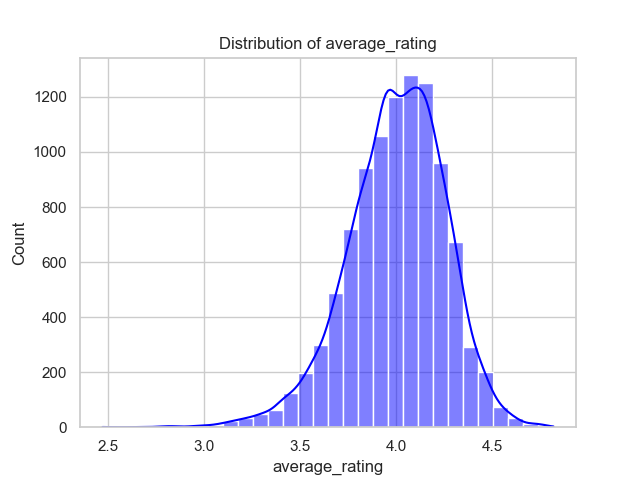

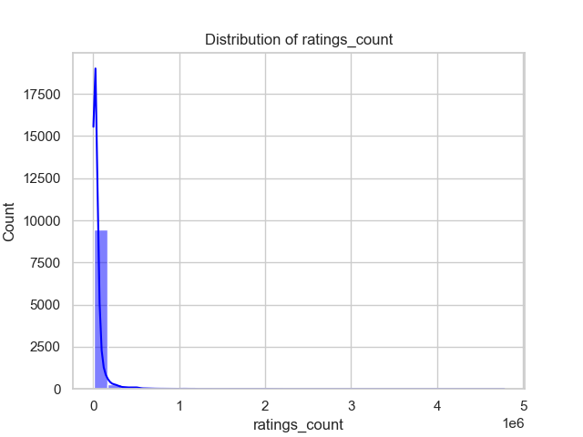

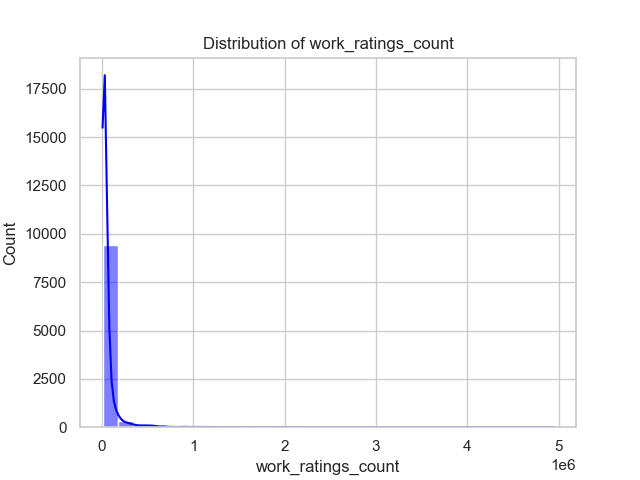

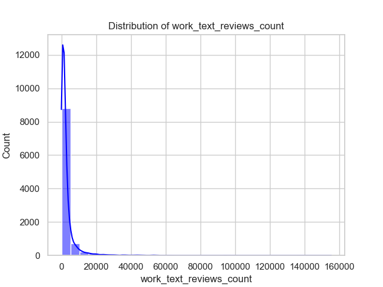

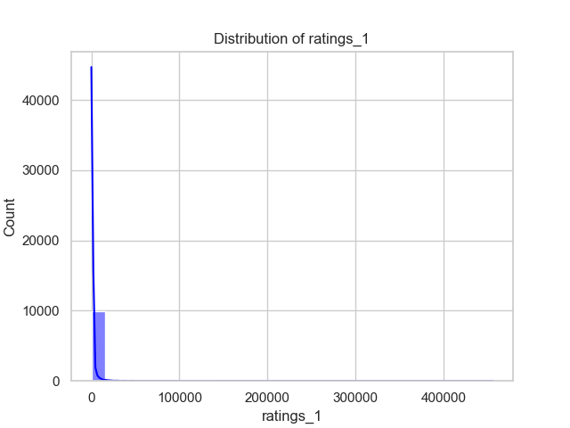

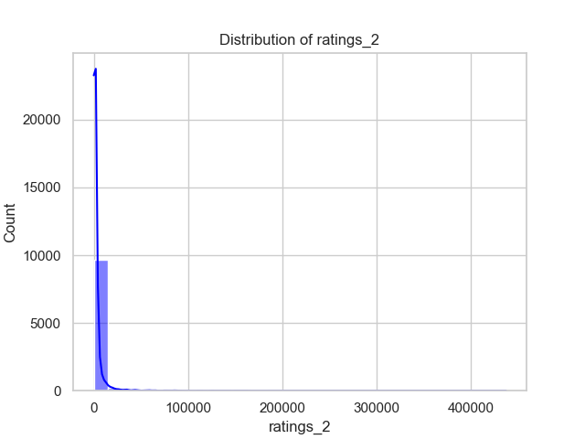

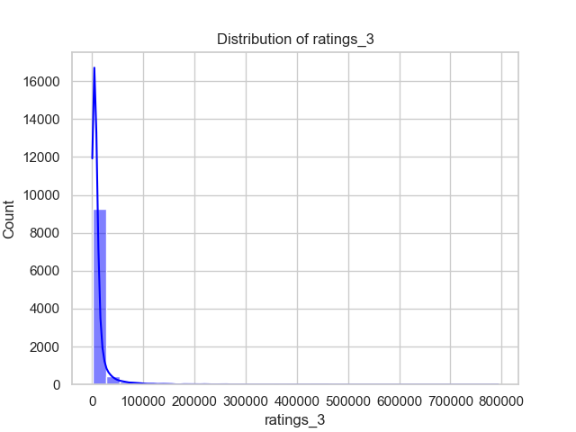

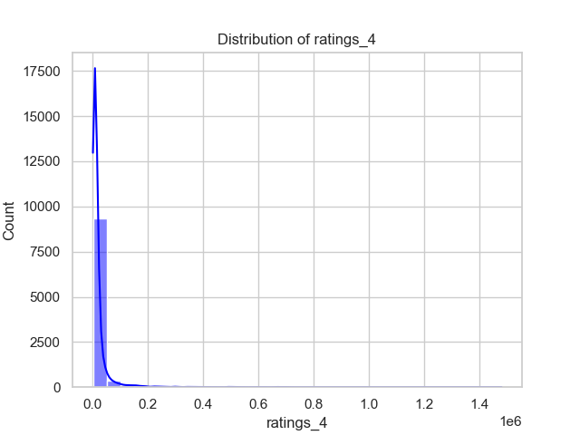

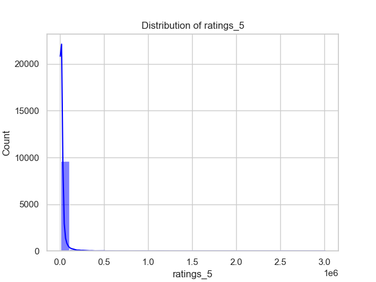

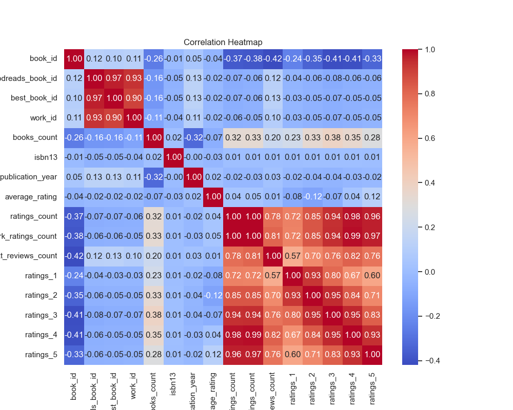

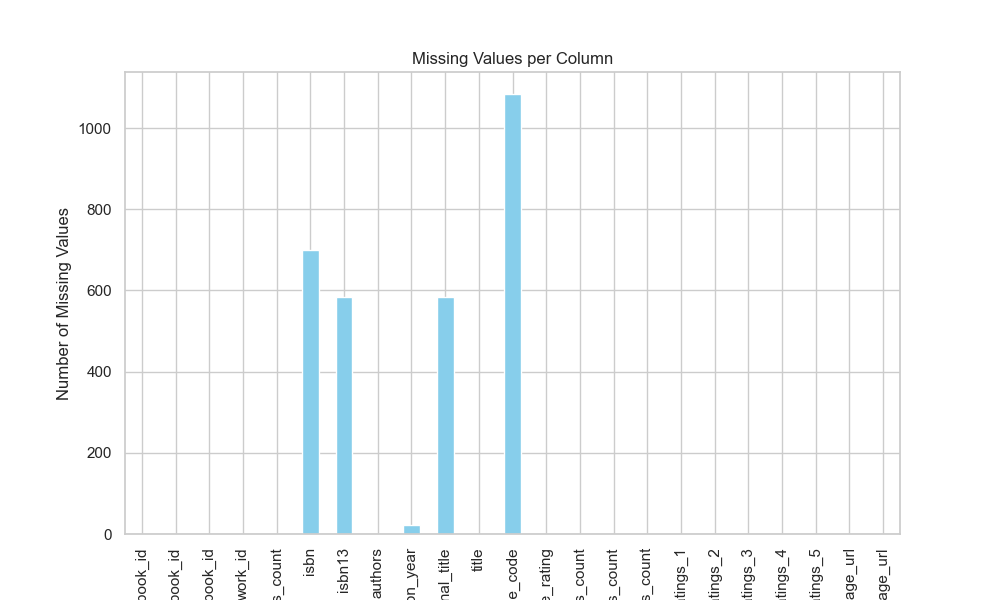

