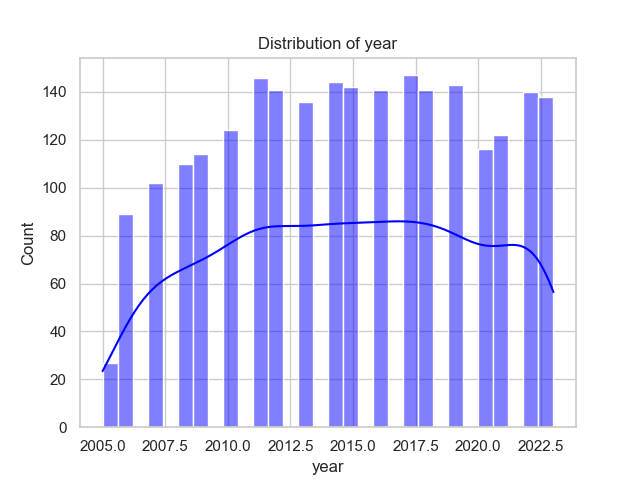

# Automated Analysis Results

## Dataset Overview
Columns: Country name, year, Life Ladder, Log GDP per capita, Social support, Healthy life expectancy at birth, Freedom to make life choices, Generosity, Perceptions of corruption, Positive affect, Negative affect

## Data Types

Column | Data Type
|---|---|
Country name | object
year | int64
Life Ladder | float64
Log GDP per capita | float64
Social support | float64
Healthy life expectancy at birth | float64
Freedom to make life choices | float64
Generosity | float64
Perceptions of corruption | float64
Positive affect | float64
Negative affect | float64

## Summary Statistics

Column | Summary
|---|---|
Country name | {'count': 2363, 'unique': 165, 'top': 'Argentina', 'freq': 18, 'mean': nan, 'std': nan, 'min': nan, '25%': nan, '50%': nan, '75%': nan, 'max': nan}
year | {'count': 2363.0, 'unique': nan, 'top': nan, 'freq': nan, 'mean': 2014.7638595006347, 'std': 5.059436468192795, 'min': 2005.0, '25%': 2011.0, '50%': 2015.0, '75%': 2019.0, 'max': 2023.0}
Life Ladder | {'count': 2363.0, 'unique': nan, 'top': nan, 'freq': nan, 'mean': 5.483565806178587, 'std': 1.1255215132391925, 'min': 1.281, '25%': 4.647, '50%': 5.449, '75%': 6.3235, 'max': 8.019}
Log GDP per capita | {'count': 2335.0, 'unique': nan, 'top': nan, 'freq': nan, 'mean': 9.399671092077089, 'std': 1.1520694444710216, 'min': 5.527, '25%': 8.506499999999999, '50%': 9.503, '75%': 10.3925, 'max': 11.676}
Social support | {'count': 2350.0, 'unique': nan, 'top': nan, 'freq': nan, 'mean': 0.8093693617021277, 'std': 0.12121176420299144, 'min': 0.228, '25%': 0.744, '50%': 0.8345, '75%': 0.904, 'max': 0.987}
Healthy life expectancy at birth | {'count': 2300.0, 'unique': nan, 'top': nan, 'freq': nan, 'mean': 63.40182826086957, 'std': 6.842644351828009, 'min': 6.72, '25%': 59.195, '50%': 65.1, '75%': 68.5525, 'max': 74.6}
Freedom to make life choices | {'count': 2327.0, 'unique': nan, 'top': nan, 'freq': nan, 'mean': 0.750281908036098, 'std': 0.13935703459253465, 'min': 0.228, '25%': 0.661, '50%': 0.771, '75%': 0.862, 'max': 0.985}
Generosity | {'count': 2282.0, 'unique': nan, 'top': nan, 'freq': nan, 'mean': 9.772129710780206e-05, 'std': 0.16138760312630687, 'min': -0.34, '25%': -0.112, '50%': -0.022, '75%': 0.09375, 'max': 0.7}
Perceptions of corruption | {'count': 2238.0, 'unique': nan, 'top': nan, 'freq': nan, 'mean': 0.7439709562109026, 'std': 0.1848654805936834, 'min': 0.035, '25%': 0.687, '50%': 0.7985, '75%': 0.86775, 'max': 0.983}
Positive affect | {'count': 2339.0, 'unique': nan, 'top': nan, 'freq': nan, 'mean': 0.6518820008550662, 'std': 0.10623970474397627, 'min': 0.179, '25%': 0.572, '50%': 0.663, '75%': 0.737, 'max': 0.884}
Negative affect | {'count': 2347.0, 'unique': nan, 'top': nan, 'freq': nan, 'mean': 0.27315083084789094, 'std': 0.08713107245795021, 'min': 0.083, '25%': 0.209, '50%': 0.262, '75%': 0.326, 'max': 0.705}

## Missing Values

Column | Missing Count
|---|---|
Country name | 0
year | 0
Life Ladder | 0
Log GDP per capita | 28
Social support | 13
Healthy life expectancy at birth | 63
Freedom to make life choices | 36
Generosity | 81
Perceptions of corruption | 125
Positive affect | 24
Negative affect | 16

## Insights
### Key Insights from the Dataset Summary

1. **Dataset Composition**:
   - The dataset has information for **2363 observations** across **165 unique countries**.
   - It spans from the year **2005** to **2023**, with a mean year of approximately **2014.76**.

2. **Life Happiness Indicator (Life Ladder)**:
   - The mean Life Ladder score is around **5.48**, indicating a moderate level of life satisfaction among surveyed countries.
   - The scores have a range from **1.281** to **8.019**, suggesting significant disparities in life satisfaction across different countries.

3. **Economic Indicators**:
   - The average **Log GDP per capita** is around **9.40**, with a range that indicates differences in economic prosperity (minimum of around **5.53** and maximum of **11.68**).
   - **Missing Values**: The Log GDP per capita has **28 missing values**, which need to be addressed for comprehensive analysis.

4. **Social Support**:
   - Mean social support is **0.81**, with a relatively small standard deviation, indicating that a majority of respondents feel supported socially.
   - There are **13 missing values** for social support that need consideration.

5. **Health Indicators**:
   - The mean **Healthy life expectancy at birth** is **63.40 years** with a range suggesting some countries have much lower life expectancy.
   - There are **63 missing values** in this category, indicating potential gaps in health-related data.

6. **Freedom and Generosity**:
   - The **Freedom to make life choices** has a mean score of approximately **0.75**, indicating moderate to high personal autonomy.
   - **Generosity** scores are very low overall, with a mean close to **0**, suggesting that there might be cultural or economic factors at play.

7. **Perceptions of Corruption**:
   - The mean perception of corruption is **0.74**, suggesting that there is a significant level of perceived corruption among the respondents.

8. **Affect Metrics**:
   - Positive affect has a mean score of **0.65**, while negative affect has a mean of **0.27**, indicating that overall, individuals tend to experience more positive feelings than negative.

### Suggested Visualizations

1. **Line Chart of Life Ladder Over Years**:
   - Show trends in average Life Ladder scores across the years to visualize improvements or declines in life satisfaction.

2. **Box Plot of Life Ladder by Country**:
   - This can highlight the variation in life satisfaction across different countries and identify outliers.

3. **Scatter Plot of Log GDP per Capita vs. Life Ladder**:
   - Illustrate potential correlations between economic prosperity and life satisfaction. Adding a trend line could help visualize this relationship.

4. **Heatmap of Correlation Matrix**:
   - Display correlations among various indicators like Life Ladder, Log GDP per capita, Social support, etc. This can help identify which factors are most closely associated.

5. **Bar Chart for Average Healthy Life Expectancy by Region**:
   - Group countries by region to visualize differences in health outcomes and their relation to happiness metrics.

6. **Grouped Bar Chart of Freedom and Perceptions of Corruption**:
   - Show the average perceptions of freedom and corruption for the most representative countries to draw comparisons.

7. **Pie Chart of Missing Values**:
   - Visual representation of missing data for different indicators can highlight the completeness of data and areas that need attention.

8. **Cluster Analysis Visualization (if applicable)**:
   - Using clustering algorithms to categorize countries based on the metrics available might yield clusters of countries that experience similar life satisfaction and other metrics.

### Conclusion

The dataset presents opportunities to analyze the interplay between economic, social, and health factors and their impact on life satisfaction. Addressing the missing values will improve the reliability of any analyses performed. The suggested visualizations will help in illustrating the insights effectively and engaging stakeholders with the findings.

## Visualizations

