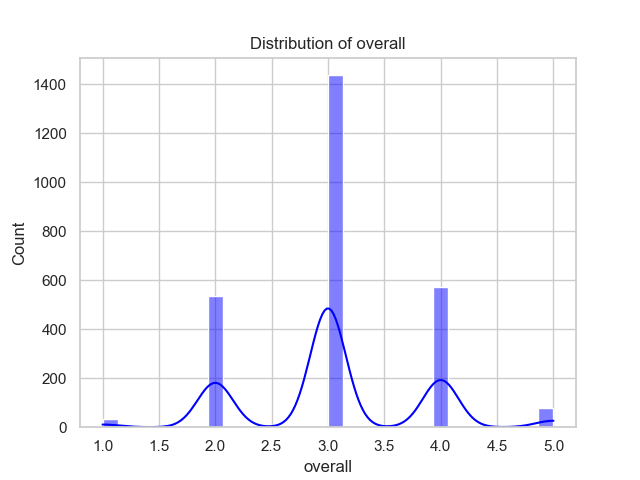

# Automated Analysis Results

## Dataset Overview
Columns: date, language, type, title, by, overall, quality, repeatability

## Data Types

Column | Data Type
|---|---|
date | object
language | object
type | object
title | object
by | object
overall | int64
quality | int64
repeatability | int64

## Summary Statistics

Column | Summary
|---|---|
date | {'count': 2553, 'unique': 2055, 'top': '21-May-06', 'freq': 8, 'mean': nan, 'std': nan, 'min': nan, '25%': nan, '50%': nan, '75%': nan, 'max': nan}
language | {'count': 2652, 'unique': 11, 'top': 'English', 'freq': 1306, 'mean': nan, 'std': nan, 'min': nan, '25%': nan, '50%': nan, '75%': nan, 'max': nan}
type | {'count': 2652, 'unique': 8, 'top': 'movie', 'freq': 2211, 'mean': nan, 'std': nan, 'min': nan, '25%': nan, '50%': nan, '75%': nan, 'max': nan}
title | {'count': 2652, 'unique': 2312, 'top': 'Kanda Naal Mudhal', 'freq': 9, 'mean': nan, 'std': nan, 'min': nan, '25%': nan, '50%': nan, '75%': nan, 'max': nan}
by | {'count': 2390, 'unique': 1528, 'top': 'Kiefer Sutherland', 'freq': 48, 'mean': nan, 'std': nan, 'min': nan, '25%': nan, '50%': nan, '75%': nan, 'max': nan}
overall | {'count': 2652.0, 'unique': nan, 'top': nan, 'freq': nan, 'mean': 3.0475113122171944, 'std': 0.7621797580962717, 'min': 1.0, '25%': 3.0, '50%': 3.0, '75%': 3.0, 'max': 5.0}
quality | {'count': 2652.0, 'unique': nan, 'top': nan, 'freq': nan, 'mean': 3.2092760180995477, 'std': 0.7967426636666686, 'min': 1.0, '25%': 3.0, '50%': 3.0, '75%': 4.0, 'max': 5.0}
repeatability | {'count': 2652.0, 'unique': nan, 'top': nan, 'freq': nan, 'mean': 1.4947209653092006, 'std': 0.598289430580212, 'min': 1.0, '25%': 1.0, '50%': 1.0, '75%': 2.0, 'max': 3.0}

## Missing Values

Column | Missing Count
|---|---|
date | 99
language | 0
type | 0
title | 0
by | 262
overall | 0
quality | 0
repeatability | 0

## Insights
Based on the provided dataset summary, we can derive a series of insights and suggest appropriate visualizations to further analyze the data. Here are the key points and potential visualizations to highlight findings from the dataset:

### Key Insights

1. **Data Composition**:
   - The dataset consists of 2,652 entries, indicating it's relatively large and likely suitable for meaningful analysis.
   - There are 11 unique languages, with **English** being the most frequent (1,306 occurrences).

2. **Content Type**:
   - The predominant type of content in this dataset is **movies**, making up 2,211 of the total entries, which raises questions about the representation of other types like TV shows or documentaries.

3. **Title Popularity**:
   - The title **"Kanda Naal Mudhal"** appears 9 times, suggesting it is one of the more frequently reviewed titles. This could prompt further investigation into why it is popular or significant.

4. **Top Contributor**:
   - **Kiefer Sutherland** is noted as the person with the most contributions to the dataset (48 entries). This could indicate his works are prevalent or perhaps highly rated, warranting deeper analysis.

5. **Understanding Ratings**:
   - **Overall Rating**: The average overall rating is approximately 3.05, which indicates a mixed performance across the titles but generally leans towards a slightly above-average perception.
   - **Quality Rating**: The quality rating is marginally higher at around 3.21, suggesting that while overall enjoyment may be moderate, perceived quality is better.
   - **Repeatability**: The repeatability score averages 1.49, with most entries scoring 1 (non-repeatable), implying that these titles are not watched multiple times or are considered not very rewatchable.

6. **Missing Values**:
   - There are 99 missing dates and 262 missing entries for the 'by' column (likely referring to the contributor). This significant amount of missing data in the latter might affect analyses related to author contributions.

### Visualizations to Consider

1. **Bar Chart of Content Type**:
   - A bar chart depicting the counts of different types could clarify the dominance of movies over other categories.

2. **Pie Chart of Languages**:
   - A pie chart representing the distribution of entry counts by language would provide a visual breakdown of linguistic diversity.

3. **Histogram of Overall Ratings**:
   - A histogram showing the distribution of overall ratings (1 to 5) will help visualize how users perceive these titles in aggregate.

4. **Box Plot for Quality Ratings**:
   - A box plot could summarize the quality rating distributions, highlighting outliers and the range of scores.

5. **Heatmap of Contributions**:
   - A heatmap might showcase the contribution patterns of different authors (like Kiefer Sutherland) across various types and languages of entries.

6. **Time Series Analysis**:
   - If dates were adequately cleaned, a time series graph could help identify trends over time related to content ratings or releases.

7. **Correlation Matrix**:
   - A correlation matrix could elucidate relationships between the numeric variables (overall, quality, repeatability), which may reveal patterns regarding ratings.

### Conclusion
The dataset provides interesting metrics about movie ratings, contributor influences, and content diversity. Exploring these aspects visually will not only clarify the underlying data distributions but also uncover relationships that could enhance understanding of consumer preferences and content popularity.

## Visualizations

